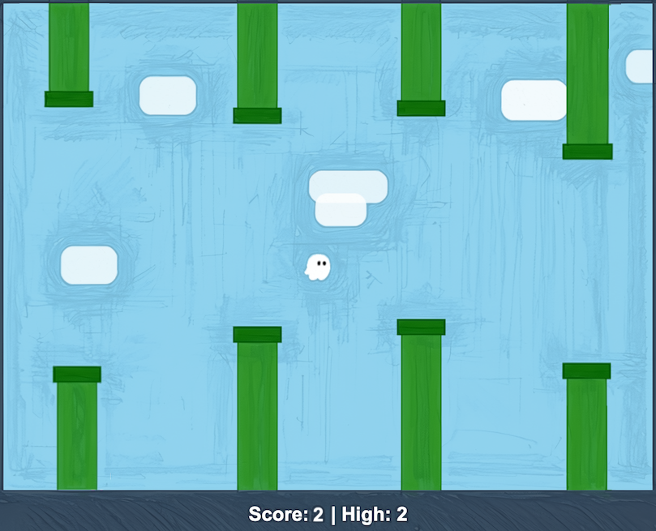

# Kiro Workshop：用 Flappy Kiro 學 AI 輔助開發

{ width="520" }

!!! tip "本課程網址"

    **[parin.dev/kiro](https://parin.dev/kiro)**

    換裝置或想分享給別人時，記這個就好。

這是一份 Kiro 實作課程教材，改寫自 AWS 官方的 [Kiro Express workshop](https://catalog.workshops.aws/kiro-express/en-US/)。

你會從零建出 **Flappy Kiro** — 一款在瀏覽器中執行的街機風無盡跑酷遊戲，主角是友善的幽靈 **Ghosty**。過程中你會實際體驗 Kiro 的 **spec-driven development**：先定義需求，再與 AI 協作精修設計，然後引導 Kiro 逐項完成實作 — 而你全程掌握主導權。

---

## 課程資訊

| 項目 | 內容 |
|---|---|
| **時間** | 核心章節約 **90 分鐘**（第 1-7 章） |
| **難度** | 中階。有基本程式能力會更順，但 Kiro 會協助 |
| **適合對象** | 軟體工程師、low-code 轉型者，以及任何想體驗 AI 輔助開發的人 |
| **需要 AWS 帳號嗎** | **不需要**。用 AWS Builder ID 登入 Kiro 即可 |
| **會用到什麼資源** | 全程在本機執行，不建立任何 AWS 資源。Kiro 本身的使用會消耗你方案的 credits — 見[用量說明](00-prerequisites.md#credits) |

---

## 開始之前

!!! warning "請先完成行前準備"
    請在課程開始前完成 [第 0 章：行前準備](00-prerequisites.md)，特別是 Kiro IDE 的安裝與登入。登入流程與企業網路的防火牆設定最花時間，提早處理會順利很多。

快速檢查你的環境（[取得檢查腳本](https://github.com/ParinLL/kiro-workshop-requirement/tree/main/scripts)）：

=== "macOS"

    ```bash
    bash scripts/check-prereqs.sh
    ```

=== "Windows"

    ```powershell
    .\scripts\check-prereqs.ps1
    ```

---

## 章節

| # | 章節 | 內容 | 時間 |
|---|---|---|---|
| 0 | [行前準備](00-prerequisites.md) | 環境需求、防火牆設定、驗證清單 | 課前 |
| 1 | [開始 Workshop](01-setup.md) | 安裝 Kiro、認識介面、取得 starter kit、`git init` | 10 分 |
| 2 | [產生需求規格](02-requirements.md) | 用 Spec 產生並精修 `requirements.md` | 25 分<br>（2-4 合計） |
| 3 | [產生設計規格](03-design.md) | 產生並精修 `design.md` | |
| 4 | [產生實作任務](04-tasks.md) | 產生並精修 `tasks.md` | |
| 5 | [建立 Steering 檔案](05-steering.md) | 定義專案慣例與程式標準 | 15 分<br>（5-6 合計） |
| 6 | [建構應用程式](06-build.md) | 執行 tasks，讓 Kiro 把遊戲做出來 | |
| 7 | [執行 Flappy Kiro](07-run.md) | 執行遊戲、修 bug、加功能 | — |
| 8 | [（選配）更進一步](08-going-further.md) | Subagents、Checkpointing、Hooks、MCP、Skills | — |

---

## 你會學到的 Kiro 能力

| 能力 | 章節 |
|---|---|
| **Spec-driven development** — requirements → design → tasks 的結構化流程 | [2](02-requirements.md) [3](03-design.md) [4](04-tasks.md) |
| **Steering** — 用持久的專案慣例約束 AI 產出 | [5](05-steering.md) |
| **Agentic build** — 讓 Kiro 自主執行任務、自我檢查並迭代 | [6](06-build.md) |
| **Subagents** — 獨立上下文的平行 agent | [8.1](08-going-further.md#subagents) |
| **Checkpointing** — 安全實驗與回捲 | [8.2](08-going-further.md#checkpointing) |
| **Hooks** — 事件驅動的自動化 | [8.3](08-going-further.md#hooks) |
| **MCP** — 連接外部工具擴充能力 | [8.4](08-going-further.md#mcp) |
| **Skills** — 可攜、可分享的指令包 | [8.5](08-going-further.md#skills) |

---

## 課程範圍

本課程專注在 Kiro 的開發流程本身，**全程在本機執行**，不含雲端部署環節，因此不需要 AWS 帳號，也不會建立任何 AWS 資源。

素材都已備妥：角色圖、三種可聽覺區分的音效，以及一段可無縫循環的背景音樂。你在需求階段就能放心把音訊回饋寫進規格，不必自己找素材。

行前準備附有兩個平台的環境檢查腳本，可在課前自行驗證。

---

## 參考連結

- AWS 官方 Kiro Express workshop：<https://catalog.workshops.aws/kiro-express/en-US/>
- Kiro 官網：<https://kiro.dev/>
- Kiro 下載：<https://kiro.dev/downloads/>
- Kiro 文件：<https://kiro.dev/docs/>
- Kiro MCP Server Directory：<https://kiro.dev/docs/mcp/servers/>
- AWS Builder ID：<https://profile.aws.amazon.com/>
- Kiro Discord 社群：<https://discord.gg/kirodotdev>
- Kiro GitHub 範例：<https://github.com/kirodotdev>

---

準備好了嗎？從 [第 0 章：行前準備](00-prerequisites.md) 開始。
